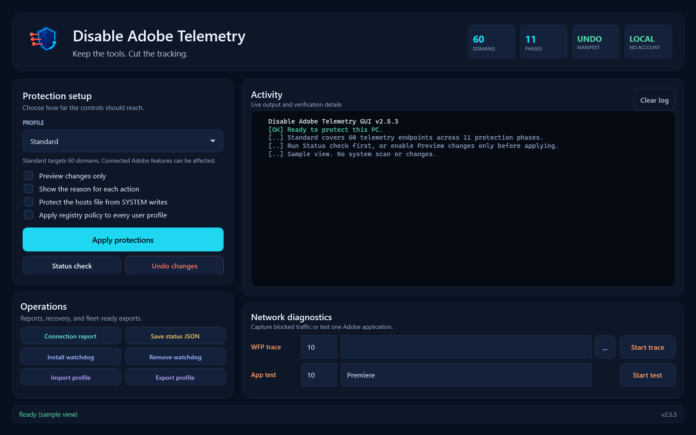
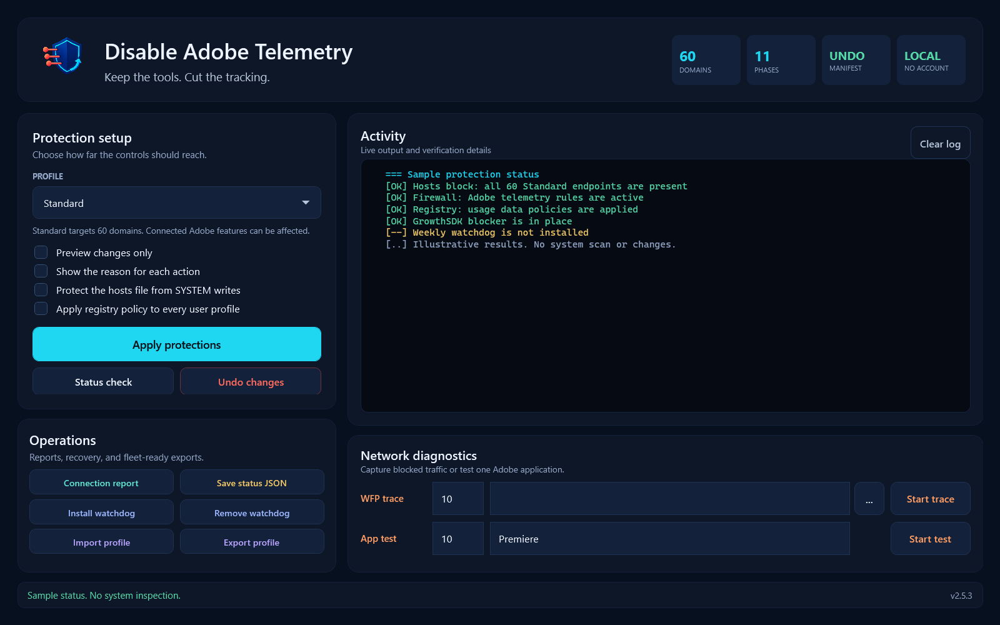
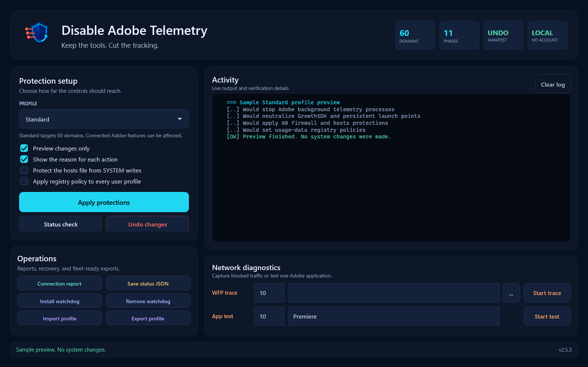

<p align="center">
  
</p>

<h1 align="center">Disable Adobe Telemetry</h1>

<p align="center"><strong>Preview Adobe telemetry controls on Windows, then apply the changes you choose.</strong></p>

<p align="center">
  
  
  
  
</p>

<p align="center">
  <a href="https://github.com/SysAdminDoc/Disable-AdobeTelemetry/releases/download/v2.5.3/Disable-AdobeTelemetry-v2.5.3.zip"><strong>Download v2.5.3</strong></a>
  &nbsp;&bull;&nbsp;
  <a href="#start-safely">Start safely</a>
  &nbsp;&bull;&nbsp;
  <a href="#undo-and-recovery-limits">Undo and recovery limits</a>
</p>

Adobe applications can leave analytics frameworks, scheduled tasks, services,
and background processes running after the creative app closes. This project
gives you one place to preview the controls and choose what to apply. A saved
manifest records supported changes for undo; it isn't a full system backup.

It doesn't require an account. Standard ships with 60 domain rules across
11 phases. Some connected Adobe features and background updates can be affected,
so review the tradeoffs before using it on a working machine.

## See the control center



<table>
  <tr>
    <td width="50%"></td>
    <td width="50%"></td>
  </tr>
  <tr>
    <td align="center"><strong>Check each protection layer</strong></td>
    <td align="center"><strong>Preview before writing changes</strong></td>
  </tr>
</table>

These screenshots show sample states in the real WPF interface, not a scan of a
protected computer. The offscreen capture path blocks protection commands and
doesn't read the normal update cache. The [capture record](assets/screenshots/capture-report.json)
identifies the exact scripts, branding files, and PNGs by SHA-256.

## Why people use it

| What matters | How the project handles it |
|---|---|
| Start cautiously | Status Check inspects first. Preview shows planned actions without applying protections. |
| Pick the right pressure | Minimal, Standard, and Aggressive profiles make the tradeoff explicit. |
| Keep control | Run all 11 phases or choose individual process, service, registry, firewall, hosts, and startup phases. |
| Review recovery | Undo uses the saved manifest for supported changes. Deleted cache contents aren't backed up. |
| Verify the result | Console, GUI, JSON status, JSONL logs, and Windows event records support personal and fleet use. |
| Stay local | No account or cloud dashboard is required. Update checks contact GitHub and keep a local cache. |

## Start safely

1. Download and extract [`Disable-AdobeTelemetry-v2.5.3.zip`](https://github.com/SysAdminDoc/Disable-AdobeTelemetry/releases/download/v2.5.3/Disable-AdobeTelemetry-v2.5.3.zip).
2. Open `Disable-AdobeTelemetry.GUI.ps1`. Windows will request administrator access.
3. Run **Status check** to see the current state.
4. Enable **Preview changes only**, then run **Apply protections** to review the plan.
5. Turn preview off and apply when the result matches what you want.

The default Standard profile is the sensible starting point. Close Adobe apps
before applying so files and services aren't held open.

Preview skips protection changes, but the CLI can still write logs and refresh
its GitHub update cache. It isn't a sandbox or a substitute for a backup.

## Choose a profile

| Profile | Best for | Tradeoff |
|---|---|---|
| Minimal | A light touch | Blocks 22 pure-telemetry domains and stops target processes. |
| Standard | Most personal workstations | Uses 60 domains and all normal protection phases. Sign-in and download endpoints stay safelisted. |
| Aggressive | Machines where cloud features aren't needed | Expands to 75 domains and can affect Fonts, Libraries, search, or other connected Adobe features. |

## What it changes

| Control | What happens |
|---|---|
| GrowthSDK | Removes the analytics framework and places a protected blocker at the same path. |
| Background processes | Stops Adobe telemetry helpers and selected persistent processes. |
| Scheduled tasks and services | Disables known telemetry, updater, and genuine-monitoring entries. |
| Registry policy | Applies Adobe enterprise and Acrobat usage-data settings. |
| Firewall | Blocks resolved telemetry addresses and known telemetry executables. |
| Hosts file | Adds a clearly marked sinkhole block and removes Adobe WAM reinjection markers. |
| Startup entries | Disables Adobe auto-run entries under HKLM and HKCU. |
| CCXProcess | Renames the executable, adds an IFEO fallback, and applies an execute deny when needed. |

AdobeIPCBroker stays executable because Photoshop and Premiere rely on its local
IPC behavior. Only its outbound traffic is blocked.

## Know the tradeoffs

- Administrator access is required because the tool changes services, firewall rules, the hosts file, and protected registry paths.
- Security software may flag the IFEO debugger entry. The exact keys are documented below, and Undo removes the entries created by this tool.
- Adobe updates can restore files or settings. Status Check and the optional weekly watchdog help you detect that drift.
- Aggressive can break connected Adobe features. Start with Standard unless you already know those features are disposable.
- The release includes SHA256 checksums but isn't Authenticode-signed because this project does not yet have a code-signing certificate.

## Undo and recovery limits

Use **Undo changes** in the GUI or run:

```powershell
.\Disable-AdobeTelemetry.ps1 -Undo
```

Undo replays supported actions from `%APPDATA%\Disable-AdobeTelemetry\undo-manifest.json`.
It can restore recorded settings and renamed files, and remove blocker files.
It cannot recover deleted GrowthSDK or cache contents, reopen stopped processes,
or recover unsaved work. Save your work and keep an independent backup first.
If the manifest is missing, unreadable, or from an older schema, the script falls
back to broader legacy cleanup. Review the log for anything it couldn't restore.

## Blocked Domains

Domains are tiered by profile. **Minimal** covers 22 pure-telemetry domains. **Standard** is the default with 60 domains, including messaging, crash reporting, Firefly/GenAI, Sensei, and genuine-license checks. **Aggressive** expands to 75 domains, including Fonts/Typekit, CC extensions, home, search, and RUM. Aggressive also blocks the primary apps' outbound traffic (`Acrobat.exe`/`AcroRd32.exe`), recursively firewalls every `.exe` under the Adobe install paths, and blocks DNS-over-TLS on port 853. The canonical lists live in [`Data/Inventories.psd1`](Data/Inventories.psd1). The list safelists selected sign-in and download domains, but that doesn't guarantee compatibility with every app, license type, shared IP address, or future Adobe update. Compare the controls with [Adobe's required network endpoints](https://helpx.adobe.com/business/enterprise/manage-services/configure-services/network-endpoints.html) and test the workflows you rely on.

The Standard profile blocks outbound connections to:

```
acp-ss-ew1.adobe.io          ada.adobe.io                 adobe.demdex.net
adobe.tt.omtrdc.net          adobedc.demdex.net           adobeid-na1.services.adobe.com
aepxlg.adobe.com             analytics.adobe.com          armmf.adobe.com
assets.adobedtm.com          bam.nr-data.net              cai-splunk-proxy.adobe.io
cc-api-data.adobe.io         cc-cdn.adobe.com             cc-collab.adobe.io
cdn.experience.adobe.net     client.messaging.adobe.com   crlog-crcn.adobe.com
crs.cr.adobe.com             dc-genai-access-provisioning-api.adobe.io
dcs.adobedc.net              detect-ccd.creativecloud.adobe.com
dpm.demdex.net               fire-fly.adobe.io            firefly-ae.adobe.io
fls.doubleclick.net          fp.adobestats.io             genuine.adobe.com
geo2.adobe.com               hbc.adobe.io                 hbrcv.adobe.com
hz-telemetry-next.adobe.io   hz-telemetry.adobe.io        ic.adobe.io
js-agent.newrelic.com        lcs-cops.adobe.io            lcs-entitlement.adobe.io
lcs-robs.adobe.io            lcs-ulecs.adobe.io           na1r.services.adobe.com
notify.adobe.io              o1383653.ingest.sentry.io    o1383653.ingest.us.sentry.io
odin.adobe.com               p13n.adobe.io                platform.adobe.io
prod-rel-ffc-ccm.oobesaas.adobe.com                       prod.adobegc.com
prod.adobegenuine.com        r.openx.net                  scss-prod-ew1.adobesc.com
scss.adobesc.com             sensei-irl1.adobe.io         senseicore-ew1.adobe.io
senseimds.adobe.io           server.messaging.adobe.com   sstats.adobe.com
stats.adobe.com              ui.messaging.adobe.com       utut-service.adobe.com
```

## The "Triple-Layer" Approach

For persistent executables like CCXProcess that Adobe apps relaunch on startup, the script uses three layers of defense:

1. **Rename.** The executable is renamed to `.disabled` so nothing can find it at the expected path.
2. **IFEO redirect.** An Image File Execution Options debugger key is set to a non-existent path (`AdobeTelemetryBlock.invalid`). Even if Adobe restores the original executable during an update, Windows intercepts the launch and silently kills it.
3. **ACL deny.** If the rename fails due to a file lock, execute permissions are stripped with a deny ACL for Everyone.

For GrowthSDK, a similar approach is used: the directory is replaced with a read-only, system-hidden file with a deny ACL on write/delete, preventing Adobe from recreating the directory structure.

> **Note:** AdobeIPCBroker.exe is **not** given this treatment. Premiere Pro and Photoshop need it to start. The tool blocks only its outbound traffic, so local inter-process communication keeps working. If an older run disabled IPCBroker, the current version restores it automatically.

## Antivirus / EDR Notes (IFEO)

The IFEO debugger redirect used to neutralize `CCXProcess.exe`, `Creative Cloud Helper.exe`, and `AdobeNotificationClient.exe` sets an `Image File Execution Options\<exe>\Debugger` registry value pointing at a non-existent path. This is a legitimate, documented Windows mechanism, but it is also catalogued as [MITRE ATT&CK T1546.012 (Image File Execution Options Injection)](https://attack.mitre.org/techniques/T1546/012/) because malware abuses the same key for persistence.

As a result, some security products may flag the script's registry writes:

- **Malwarebytes** may report `RiskWare.IFEOHijack`.
- **EDR/SIEM** (Elastic, Splunk, Defender for Endpoint) may raise a registry-modification alert on the IFEO path.

Treat an alert as something to investigate, not automatically as a false positive.
Compare the script's hash and exact registry targets before deciding how to respond.
In a managed environment, have your security team review it. Don't disable
protection or add a broad exclusion just to run the tool.

- The redirects target only the three Adobe executables above; the debugger value always resolves to `%SystemRoot%\System32\AdobeTelemetryBlock.invalid`, so the entries are easy to identify and audit.
- `-Undo` removes all IFEO entries the script created.

To omit the CCXProcess neutralization phase, use `-Skip CCXProcess`. This also skips that phase's renaming and ACL changes, not just the IFEO entry.

## Install

Download the latest release ZIP from [GitHub Releases](https://github.com/SysAdminDoc/Disable-AdobeTelemetry/releases/latest), extract, and run. The ZIP includes the CLI, GUI, illustrated guide, license, and complete [original artwork archive](assets/brand/concepts/README.md).

```powershell
# Verify the download checksum
(Get-FileHash Disable-AdobeTelemetry-v2.5.3.zip -Algorithm SHA256).Hash
# Compare against the hash in SHA256SUMS.txt from the same release
```

Or clone the repo directly:

```powershell
git clone https://github.com/SysAdminDoc/Disable-AdobeTelemetry.git
cd Disable-AdobeTelemetry
```

## Usage

### Requirements

- Windows 10/11
- PowerShell 5.1+
- **Administrator privileges** (the script requests them through UAC when needed)

### GUI

```powershell
.\Disable-AdobeTelemetry.GUI.ps1
```

A dark WPF control center with the same operations as the CLI. It includes profile selection, preview mode, live output, watchdog controls, profile import and export, JSON status, WFP trace configuration, and application plumbing tests. It requests administrator access through UAC when needed.

### CLI

```powershell
# Run from any PowerShell prompt (requests administrator access through UAC)
.\Disable-AdobeTelemetry.ps1

# Preview protections without applying them (logs and update cache may be written)
.\Disable-AdobeTelemetry.ps1 -DryRun

# Run only specific phases (Kill, GrowthSDK, CCXProcess, IPCBroker, Tasks, Services, Registry, Firewall, Hosts, Acrobat, Startup)
.\Disable-AdobeTelemetry.ps1 -Only Firewall,Hosts

# Run everything except process killing
.\Disable-AdobeTelemetry.ps1 -Skip Kill

# -Only and -Skip can be combined; -Skip always wins (this runs Firewall only)
.\Disable-AdobeTelemetry.ps1 -Only Firewall,Hosts -Skip Hosts

# Also deny SYSTEM write on the hosts file so Adobe WAM cannot re-inject its entry
# (opt-in: the SYSTEM watchdog can no longer reassert hosts entries while locked)
.\Disable-AdobeTelemetry.ps1 -LockHostsFile

# Apply the per-user telemetry policies to every profile, not just the current user
# (opt-in: loads/unloads logged-out users' NTUSER.DAT hives; reversed by -Undo)
.\Disable-AdobeTelemetry.ps1 -AllUsers

# Light touch: block telemetry domains and kill processes only (no service/task/registry changes)
.\Disable-AdobeTelemetry.ps1 -Profile Minimal

# Maximum blocking: includes font domains and cloud library endpoints
.\Disable-AdobeTelemetry.ps1 -Profile Aggressive

# Save work first: stop helpers, run Photoshop, stop helpers again on exit
.\Disable-AdobeTelemetry.ps1 -Launcher Photoshop

# Export or import a validated fleet profile
.\Disable-AdobeTelemetry.ps1 -ExportProfile .\standard-profile.json
.\Disable-AdobeTelemetry.ps1 -ImportProfile .\standard-profile.json

# Check current status of all protections
.\Disable-AdobeTelemetry.ps1 -StatusOnly

# Install weekly watchdog (Mondays 9 AM) to reassert blocks after Adobe updates
.\Disable-AdobeTelemetry.ps1 -InstallWatchdog

# Undo supported recorded changes
.\Disable-AdobeTelemetry.ps1 -Undo
```

The script executes immediately without confirmation prompts and recommends a reboot at completion.

Imported profiles fail closed before any protection phase runs. A profile must contain `SchemaVersion`, `Version`, `Profile`, and `Domains`; invalid JSON, unsupported schema versions, invalid profile tiers, invalid phase names, or malformed domains exit with code `2`.

After apply, the script verifies that the hosts block remains present, Adobe WAM hosts markers are absent, `detect-ccd.creativecloud.adobe.com` resolves to a sinkhole entry, firewall block rules exist, Dynamic Keyword rules exist when supported, and no Adobe-owned outbound connections remain. Verification failures are written to console output, JSONL logs, and `-StatusOnly -OutputFormat JSON`.

Upstream domain merges are recorded in the JSONL log with source and validation details. Successful live fetches update a last-good domain cache under `%APPDATA%\Disable-AdobeTelemetry`; failed fetches use that cache when available. `-DryRun` merges domains in memory without saving that domain cache or applying protections. Text logs and the separate release-update cache can still be written.

### Machine-Readable Output

```powershell
# JSON status snapshot for fleet management / automation
.\Disable-AdobeTelemetry.ps1 -StatusOnly -OutputFormat JSON
```

JSON status includes registry policy convergence entries for Adobe enterprise, Acrobat/Reader, Wow6432Node, Substance 3D, and current-user policies. Each entry includes `Phase`, `Path`, `Name`, `Type`, `Expected`, `Actual`, and `State` for fleet compliance checks.

Each apply/undo run also writes a structured JSONL log to `%APPDATA%\Disable-AdobeTelemetry\logs\Disable-AdobeTelemetry-<timestamp>.jsonl` with per-action entries for ingestion by fleet management tools.

A run-summary entry is also written to the **Windows Application event log** (source `Disable-AdobeTelemetry`) so SIEM/EDR pipelines can track outcomes without parsing files. Event IDs: `1000` = apply success, `2000` = apply partial (one or more phase errors), `3000` = failure, `4000` = undo. Dry runs do not write events. `-StatusOnly` reports whether the event source is registered.

### Intune Proactive Remediation

The [`fleet/`](fleet/) directory contains a detection/remediation script pair for Microsoft Intune (Proactive Remediations / device remediations):

- **`fleet/Detect-AdobeTelemetry.ps1`** runs the main script in `-StatusOnly -OutputFormat JSON`, evaluates stable compliance signals (hosts block present, firewall rules present, target services blocked), and exits `0` for compliant or `1` to remediate.
- **`fleet/Remediate-AdobeTelemetry.ps1`** applies protections and maps the main script's exit codes (`0`/`3010` for success) to Intune's `0`/`1` convention.

Deploy `Disable-AdobeTelemetry.ps1` to the endpoint (for example, `%ProgramData%\Disable-AdobeTelemetry\`) or pass `-ScriptPath`. Both wrappers search common locations automatically. Run them in the 64-bit **system** context. No interactive UAC prompt is required because SYSTEM already has the needed access.

### Exit Codes

| Code | Meaning |
|------|---------|
| `0` | Success (no reboot needed) or dry run completed |
| `1` | Fatal error |
| `2` | Invalid arguments |
| `3` | Partial success (some phases encountered errors) |
| `3010` | Success, reboot recommended (SCCM/Intune convention) |

### Best Results

For the cleanest run, close all Adobe applications before executing. If a rename operation reports "file locked," reboot and run the script again before opening Adobe apps. The IFEO redirects remain active as a fallback in the meantime.

### Update Notifications

The script checks for newer GitHub releases using a local cache and a background refresh, at most once every 24 hours. If a newer version is available, it prints the release link. JSON status mode skips this check. The script fetches release metadata but doesn't download or install a new version.

### DNS-over-HTTPS (DoH)

Encrypted DNS does not automatically bypass the hosts file. Windows 11 integrates its DNS-over-HTTPS support with the system hosts file, as documented in [Microsoft's Windows security guide, page 26](https://www.microsoft.com/content/dam/microsoft/final/en-us/microsoft-brand/documents/MSFT-Windows-11-Security-Book-05-May-2023.pdf#page=26). An application using its own resolver can behave differently. The script reports selected Windows and browser DoH settings; that report is not a test of hosts-file effectiveness. Check the application's actual traffic and the firewall results. Don't disable encrypted DNS just because it appears in the status report.

## Expected Adobe behavior

Minimal and Standard are designed to preserve local editing, app launch, sign-in,
and manual downloads through Creative Cloud. Sign-in, activation, and download
hosts stay on the hard safelist.

Blocking connected services still has consequences. Standard can reduce in-app
messages, crash reporting, cloud Libraries, Firefly and Sensei calls, genuine
software checks, and automatic background updates. Aggressive also targets
Fonts/Typekit, extensions, home and search services, plus the primary apps'
outbound traffic. Use Minimal if one of those features matters more than broader
blocking.

## Isolate an Adobe app problem

1. Run **Status check** and save the JSON result if you need an audit trail.
2. Use **Undo changes**, review any restore warnings, restart Windows, and test again. Deleted files may need repair or reinstallation through Adobe.
3. If the issue disappears, apply Minimal first. Add phases or move to Standard one step at a time.
4. Use `-Only` or `-Skip` to identify the exact process, service, registry, firewall, hosts, or startup phase involved.

This helps narrow down whether the controls contributed to the issue. It isn't
proof that every prior setting or deleted file was restored.

## After Adobe Updates

CC application updates may restore disabled executables. The IFEO debugger redirects survive updates and will catch any restored processes automatically. Re-run the script after major updates if you want to re-rename the executables for cleanliness.

## Reversal

```powershell
.\Disable-AdobeTelemetry.ps1 -Undo
```

`-Undo` attempts to restore supported manifest actions and remove the tool's blockers. Read the [recovery limits](#undo-and-recovery-limits) before relying on it.

## Development

Static inventories (processes, services, telemetry domains, paths) are maintained in `Data/Inventories.psd1`. After editing the data file, run `Build.ps1` to regenerate the main script:

```powershell
.\Build.ps1           # Regenerate Disable-AdobeTelemetry.ps1 from data file
.\Build.ps1 -Verify   # Check if data file and script are in sync
```

Tests:

```powershell
Invoke-Pester -Path .\Tests -Output Detailed
```

Maintainer tools use PowerShell 7; the application entry points remain compatible
with Windows PowerShell 5.1. Capture the current scripts into a review folder:

```powershell
pwsh .\tools\Capture-MarketingScreenshots.ps1 -OutputDirectory .\build\marketing-candidate
```

Compare the three screenshots before copying their PNGs and report into
`assets/screenshots`. Then run `pwsh .\tools\Build-Release.ps1` to validate and
package the delivery. For intentional artwork exports, `tools/build-brand-assets.ps1`
can update the existing templates with `-MarketingOnly -OutputDirectory <review-folder>`
without replacing the selected logo or icon family.

## License

MIT
